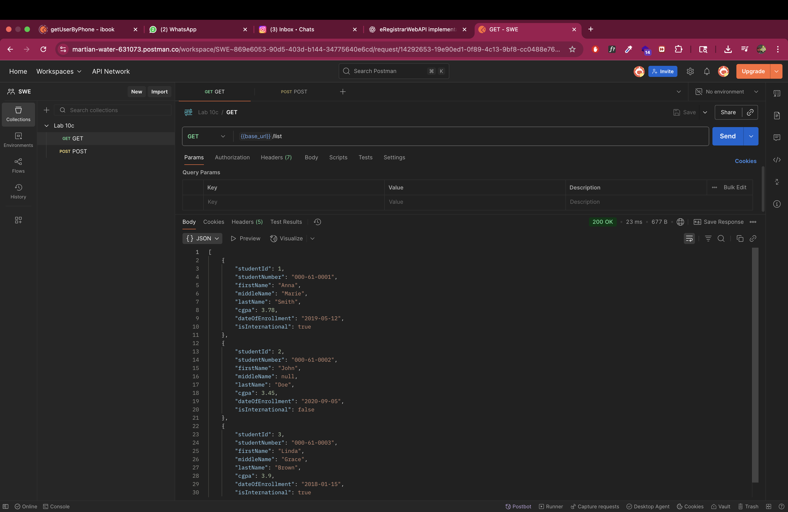
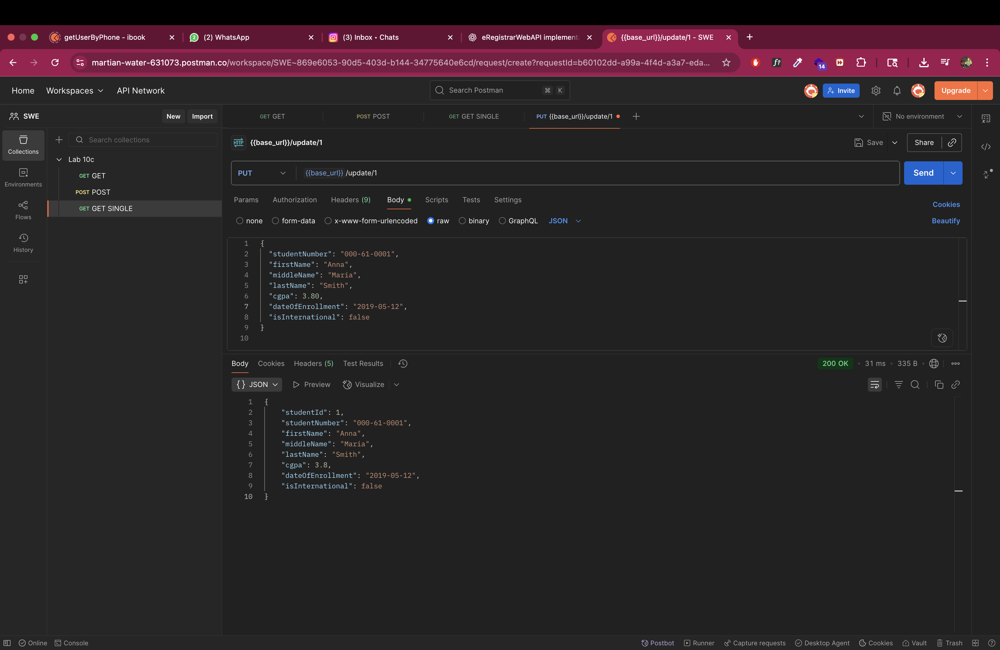
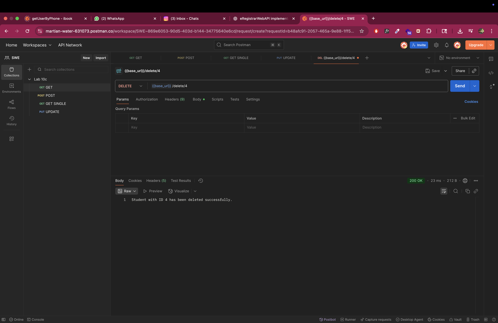

# 📚 eRegistrar Web API

A **Spring Boot RESTful Web API** for managing student registrations in a university system.  
Features include creating, retrieving, updating, and deleting student records, with proper exception handling.

---

## 🚀 API Endpoints Demonstration (via Postman)

### 1️⃣ Creating a Student
**POST** `/eregistrar/api/student/register`  
  
  

---

### 2️⃣ Getting the Student List
**GET** `/eregistrar/api/student/list`  

---

### 3️⃣ Getting a Single Student
**GET** `/eregistrar/api/student/get/{id}`  

---

### 4️⃣ Updating a Student
**PUT** `/eregistrar/api/student/update/{id}`  

---

### 5️⃣ Deleting a Student
**DELETE** `/eregistrar/api/student/delete/{id}`  

---

### 6️⃣ Getting After Deletion
**GET** `/eregistrar/api/student/list` *(after deletion)*  

---

### ⚠ Exception Handling
Example of API returning **404 Not Found** when student does not exist.  

---

## 💡 Tech Stack
- Java 17+
- Spring Boot (Web, Data JPA)
- MySQL Database
- Postman for API testing
